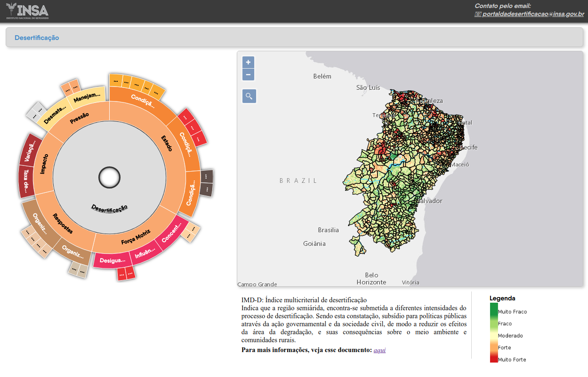

# Sunburst
This repository represent the Sunburst page what was separated of the [SADes](https://github.com/simsab-ufcg/geonode) application (INSA). This webpage contains a visualization of the semi-arid desertification.



#### NOTE 
Is necessary a refactoring because only was moved from the SADes to this repository.

## Pre-Instalation
1. Install NODE and NPM. [Ubuntu and Debian](https://tecadmin.net/install-latest-nodejs-npm-on-ubuntu/) / [Centos](https://github.com/nodesource/distributions).
2. Install GIT
```
# Ubuntu
sudo apt-get install git

# Centos
sudo yum install git
```

## Instalation 
```
  git clone https://github.com/simsab-ufcg/sunburst.git
  cd sunburst
  sudo npm install
```

## Configure
Set properties in the file 'src/js/sunburst-constants.js'

Example: 
```
# URL Geoserver
const GEOSERVER_URL = 'http://0.0.0.0/geoserver'
# URL Geonode
const GEONODE_URL = 'http://0.0.0.0'

# Layer name in the geonode
# City limits
const LAYER_LIMIT_CITY='geonode:limites_municipio'
# Layer name in the geonode
# Water occurrence
const LAYER_LIMIT_WATER='geonode:massa_daqua'
```
Set Semi-Arid Desertification Layers properties in the file 'src/js/data/desertificacao-data.js'. <br/>
The level of the Sunburst component is related with the file 'src/js/data/desertificacao-data.js'. 

Example: 
```
.
. Begin
.
var dataDesertificacao = {
  name: "Desertificação",
  name2: "Desertificação",
  color: "level_one_desertif_color",
  labelColor: "black", 
  imgName: "geonode:imd_d",
  level: 1,
  children: [
    {
      name: "Estado",
      name2: "Estado",
      color: "level_two_color",
      labelColor: "black",           
      imgName: "geonode:imd_e",
      size: 2,
      level: 2,
      children: [
        {
          name: "Condição Ambiental",
          name2: "Condição Ambiental",
          color: "level_three_estado_color",
          labelColor: "white",                  
          size: 10,
          level: 3,
          imgName: "",
          children: [
            {   

.
. End
.               

```

(Optional) Set the port to the server a file called ".env" in the root of project. Look the example in the file ".env.example".
```
# Default : 4200
PORT=80
```

## Run
```
  cd {path}/sunburst
  npm start &
```

## Stop
```
  cd {path}/sunburst
  npm stop
```
